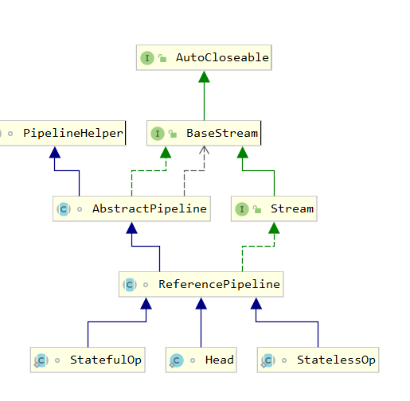
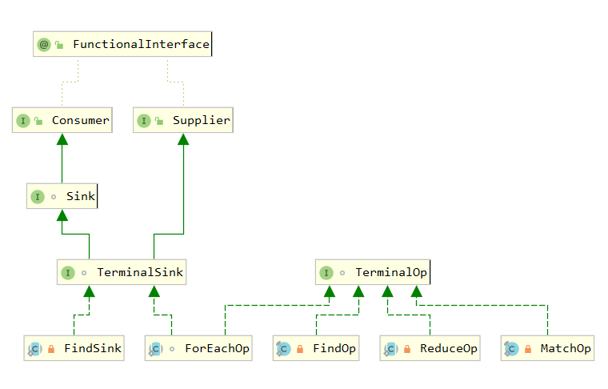

# java8学习
### 为何需要ambda表达式？

- 在Java中，我们无法将函数作为参数传递给一个方法，也无法声明返回一个函数的方法,
  也无法声明返回一个函数的方法,在JavaScript中，函数参数是一个函数，返回值是
  另一个函数的情况是非常常见的; JavaScript是-门非常典型的函数式语言.

### Lambda表达式作用

- Lambda表达式为Java添加了缺失的函数式编程特性，使我们能将函数当做一等公民看待
- 在将函数作为一等公民的语言中，Lambda表达式的类型是函数。但在Java中，Lambda表达式是对
  象，他们必须依附于一类特别的对象类型------>函数式接(functional interface).

### 关于函数式接口

1. 如果一个接口只有一个抽象方法，那么该接口就是一 个函数式接口。
2. 如果我们在某个接口上声明了FunctionalInterface注解，那么编译器就会按照函数式接口的定义来要求该接口。
3. 如果某个接口只有一个抽象方法，但我们并没有给该接口声明FunctionalInterface注解，那么编译器依旧会将该接口看作是函数式接口。
4. 代码：

```java
package com.poplar;

/**
 * BY poplar ON 2019/11/17
 */
@FunctionalInterface
interface MyInterFace {

    void test();
  /*  If an interface declares an abstract method overriding one of the public methods of java.lang.Object,
    that also does not count toward the interface's abstract method count since any implementation of the interface
    will have an implementation from java.lang.Object or elsewhere.*/
    String toString();
}

public class Test1 {

    public void testFunctionalInterface(MyInterFace interFace) {
        interFace.test();
    }

    public static void main(String[] args) {
        Test1 test1 = new Test1();
        test1.testFunctionalInterface(() -> System.out.println("implement of MyInterFace1"));
        MyInterFace myInterFace = () -> System.out.println("implement of MyInterFace2");
        myInterFace.test();//implement of MyInterFace2
        System.out.println(myInterFace.getClass());                    //Test1$$Lambda$2/1747585824
        System.out.println(myInterFace.getClass().getSuperclass());    //java.lang.Object
        System.out.println(myInterFace.getClass().getInterfaces()[0]);  //MyInterFace
    }
}
```

### 函数式接口的实例化方式

```java
/**
 * BY poplar ON 2019/11/17
 * 函数式接口的三种实例化方式
 * Note that instances of functional interfaces can be created with
 * lambda expressions, method references, or constructor references.
 */
public class Test2 {
    public static void main(String[] args) {
        List<Integer> list = Arrays.asList(1, 2, 3, 4, 5, 6, 7, 8, 9);
        //1,lambda expressions
        list.forEach((i) -> {
            System.out.println(i * 2);
        });

        //2, method references
        list.forEach(System.out::print);
        //3,TODO
    }
}
```

### Predicate

```java
package com.poplar;

import java.util.Arrays;
import java.util.List;
import java.util.function.Predicate;

/**
 * BY poplar ON 2019/11/17
 * 函数式接口Predicate
 */
public class PredicateTest {

    public static void main(String[] args) {
        List<Integer> list = Arrays.asList(1, 2, 3, 4, 5, 6, 7, 8, 9, 10);
        PredicateTest test = new PredicateTest();
        test.conditionalFilter(list, element -> element % 2 == 0);
        System.out.println("--------------------------------");
        test.findFallOdds(list);

    }

    //使用函数式接口高度抽象化的方法,其实也相当于一种策略模式
    public void conditionalFilter(List<Integer> list, Predicate<Integer> predicate) {
        for (Integer element : list) {
            if (predicate.test(element)) {
                System.out.println(element);
            }
        }
    }

    //面向对象的具体化的方法
    public void findFallOdds(List<Integer> list) {
        for (Integer integer : list) {
            if (integer % 2 == 0) {
                System.out.println(integer);
            }
        }
    }
}

```

### Function

```java
package com.poplar;

import java.util.function.Function;

/**
 * BY poplar ON 2019/11/17
 * 函数式编程
 */
public class FunctionTest {

    public static void main(String[] args) {
        FunctionTest functionTest = new FunctionTest();
        //函数式编程——>方法中可以传入行为--->高阶函数
        System.out.println(functionTest.computer(2, value -> value + 2));
        System.out.println(functionTest.convert(2, value -> String.valueOf(value + "Hello")));
    }

    /**
     * @param a        输入的参数值
     * @param function 传入的函数
     * @return 返回值
     */
    public int computer(int a, Function<Integer, Integer> function) {
        return function.apply(a);
    }

    /**
     * @param a        输入的参数值
     * @param function Integer函数的输入类型 String函数的返回类型
     * @return 返回值
     */
    public String convert(int a, Function<Integer, String> function) {
        return function.apply(a);
    }

    //传统方法,事先写好
    public int method1(int a) {
        return a + 2;
    }
}

```

### 自定义实现Collector

```java

/**
 * Created BY poplar ON 2019/11/21
 * 自定义实现Collector接口
 */
public class CustomCollector<T> implements Collector<T, Set<T>, Set<T>> {

    @Override
    public Supplier<Set<T>> supplier() {
        System.out.println("supplier invoked");
        //直接返回一个HashSet容器
        return HashSet::new;
    }

    @Override
    public BiConsumer<Set<T>, T> accumulator() {
        System.out.println("accumulator invoked");
        //此处不能直接返回具体实现类，因为supplier中已经指定了容器具体类型
        return Set::add;
    }

    @Override
    public BinaryOperator<Set<T>> combiner() {
        System.out.println("combiner invoked");
        //接收2个参数返回一个
        return (p1, p2) -> {
            p1.addAll(p2);
            return p1;
        };
    }

    @Override
    public Function<Set<T>, Set<T>> finisher() {
        System.out.println("finisher invoked");
        //return Function.identity();
        return t -> t;
    }

    @Override
    public Set<Characteristics> characteristics() {
        System.out.println("characteristics invoked");
        return Collections.unmodifiableSet(EnumSet.of(Characteristics.IDENTITY_FINISH, Characteristics.UNORDERED));
    }

    public static void main(String[] args) {
        List<String> list = Arrays.asList("hello", "hello", "world", "beautiful cat", "severn cat");
        Set<String> set = list.stream().collect(new CustomCollector<>());
        System.out.println(set);
        /*
        执行结果：
        supplier invoked
         accumulator invoked
         combiner invoked
         characteristics invoked
         characteristics invoked
         [world, severn cat, hello, beautiful cat]*/
    }
}

```

### Stream操作

- 参考链接：<https://www.cnblogs.com/CarpenterLee/p/6637118.html>

- ### 流的层次结构



### 终止操作类的层次结构



```java
/**
 * Created BY poplar ON 2019/11/23
 * 流的操作是类似于流水线的运作模式的，对于进入流中的每一个元素都会执行一遍相同的操作
 */
public class StreamTest7 {
    public static void main(String[] args) {
        List<String> list = Arrays.asList("hello", "hello", "world", "beautiful cat", "severn cat");
        //在没有中间操作和当前操作的流为串行流时或调用Head中的实现
        list.stream().forEach(System.out::println);
        //而如果有中间操作且为并行流会执行ReferencePipeline中的方法
        list.stream().map(String::toUpperCase).forEach(System.out::println);

        //Iterable接口中的默认实现方法
        list.forEach(System.out::println);
    }
}

```

### Java8时间

```java
/**
 * Created BY poplar ON 2019/11/23
 * 对于时间类的测试代码
 * UTC时间由于没有时区这种概念一般表示为：2019-11-23T21:59:55.232Z（表示没有时区）或者2019-11-23T21:59:55.232+08:00(如果有时区)
 */
public class TimeTest1 {

    //把UTC时间转换为Java时间
    public static Date covertUTCToDate(String utcDate) {
        try {
            DateTime dateTime = DateTime.parse(utcDate, DateTimeFormat.forPattern("yyyy-MM-dd'T'HH:mm:ss.SSSZ"));
            return dateTime.toDate();
        } catch (Exception e) {
            e.printStackTrace();
            return null;
        }

    }

    //把Java时间转换为UTC时间
    public static String covertDateToUTC(Date javaDate) {
        DateTime dateTime = new DateTime(javaDate, DateTimeZone.UTC);
        return dateTime.toString();
    }

    //转换为指定格式的时间
    public static String covertDateToLocalByDateFormat(Date javaDate, String dateFormat) {
        DateTime dateTime = new DateTime(javaDate);
        return dateTime.toString(dateFormat);
    }

    public static void main(String[] args) {
        System.out.println(TimeTest1.covertUTCToDate("2019-11-23T21:59:55.232Z"));
        System.out.println(TimeTest1.covertDateToUTC(new Date()));
        System.out.println(TimeTest1.covertDateToLocalByDateFormat(new Date(),"yyyy-MM-dd HH:mm:ss"));
    }
}

```

